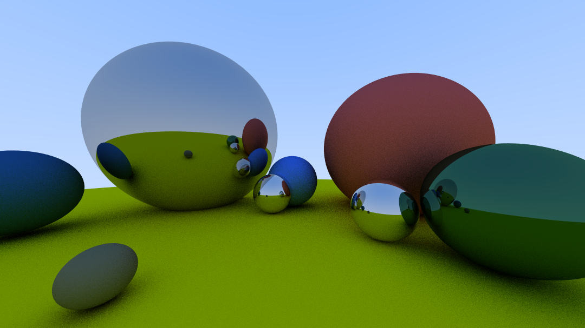

# HaskRay
A minimal ray tracer in pure Haskell (<200 LOC) following [Ray Tracing in One Weekend](https://raytracing.github.io/books/RayTracingInOneWeekend.html), rendering PPM images with `Diffuse` and `Metal` materials—implemented using only system libraries; see also my C version [CRay](https://github.com/TwinIsland/CRay).



The picture aboved rendered with config:
```haskell
  let imageWidth = 1080
      aspectRatio = 16.0 / 9.0
      imageHeight = floor (fromIntegral imageWidth / aspectRatio)
      samplesPerPixel = 50
      depthLimitation = 20

      viewportHeight = 2.0
      viewportWidth = aspectRatio * viewportHeight
      focalLength = 1.0
      originCam = Vec3 0 0 0
      horizontal = Vec3 viewportWidth 0 0
      vertical = Vec3 0 viewportHeight 0
      lowerLeftCorner =
        originCam
          ^-^ (0.5 *^ horizontal)
          ^-^ (0.5 *^ vertical)
          ^-^ Vec3 0 0 focalLength

      world =
        World $
          [ Sphere (Vec3 (-1.2) 0.4 (-2.2)) 1.0 (Metal (Vec3 0.7 0.7 0.7)),
            Sphere (Vec3 1.2 0.2 (-2.0)) 0.8 (Diffuse (Vec3 0.7 0.3 0.3)),
            Sphere (Vec3 0 (-100.5) (-1)) 100 (Diffuse (Vec3 0.8 0.8 0.0))
          ]
            ++ [ Sphere (Vec3 (-0.2) (-0.3) (-1.7)) 0.2 (Metal (Vec3 0.8 0.8 0.8)),
                 Sphere (Vec3 (-0.8) (-0.3) (-2.5)) 0.2 (Metal (Vec3 0.8 0.8 0.8)),
                 Sphere (Vec3 0.6 (-0.3) (-1.1)) 0.2 (Metal (Vec3 0.8 0.8 0.8)),
                 Sphere (Vec3 0.0 (-0.2) (-2.0)) 0.3 (Diffuse (Vec3 0.2 0.4 0.8)),
                 Sphere (Vec3 1.0 (-0.2) (-0.8)) 0.3 (Metal (Vec3 0.2 0.4 0.3)),
                 Sphere (Vec3 (-0.7) (-0.4) (-0.6)) 0.1 (Diffuse (Vec3 0.4 0.4 0.3)),
                 Sphere (Vec3 (-2.0) (-0.2) (-1.2)) 0.3 (Diffuse (Vec3 0.1 0.3 0.5))
               ]
```

## Install & Run
```
cabal run
```